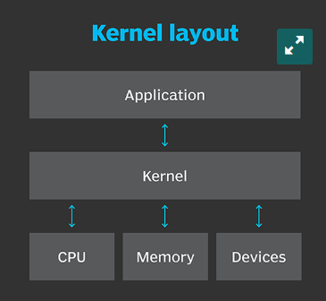
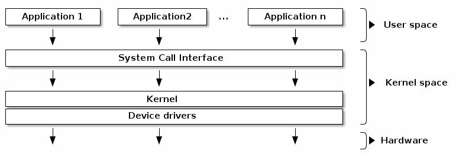
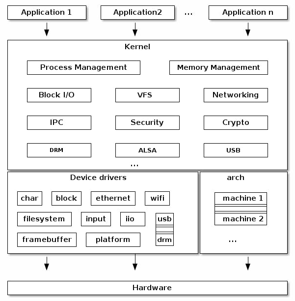
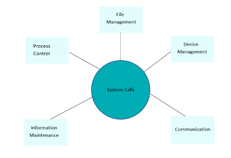
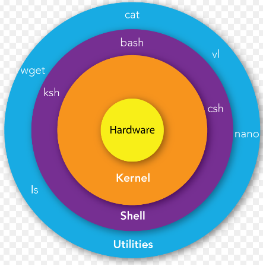

# What is linux?
- It is a Kernel.
- These are headles systems. 
- A **headless system** is a computer that operates without a monitor, graphical user interface (GUI) or peripheral devices, such as keyboard and mouse. 
# Linux Operating System:
- A computer program that organizes a number of other programs at the same time.
- It is a software that manages all of the hardware resources associated with your desktop or laptop.
- It manages the communication between your software and hardware.
- The Linux Operating System comprises several different pieces:

1. **Bootloader**: A bootloader is responsible for managing the boot process of the computer 2. and for starting the Linux kernel. It can also be used to manage systems that boot more than one OS.
2. **Kernel**: The core of the Linux system, the kernel handles the CPU, memory, and peripheral devices. The Linux kernel is the software that interfaces directly with the computer hardware.
3. **Init systems**: The first process to run once the kernel is loaded. A process is an instance of a program running on a computer, and the init system initializes the system to enable it to run other processes.
4. **Daemons**: This is a program that runs in the background, handling requests for a service that either start up during boot/user login.
5. **Graphical Server**: This is the software that controls how graphics are displayed on a computer. 
6. **Desktop Environment**: This is the collection of applications and user interface controls with which users interact when using Linux as a desktop platform. Access to the desktop environment is usually controlled through the X Window System or another graphical system.
There are many desktop environments to choose from (GNOME,KDE, etc.). Each desktop environment includes built-in applications.
7. **Applications**: This is the software that is installed during and after the initial Linux installation.     
          

# User Space vs Kernel space:
- All the modern computer operating systems generally divide the virtual memory into two following spaces:
1. Kernel space
2. User space
- The primary reason for this separation is to protect memory and hardware from malicious or third-party software's errant behavior.

**Kernel space**
- The memory space where the core of the operating system (kernel) executes and provides its services is known as kernel space. It's reserved for running device drivers, OS kernel, and all other kernel extensions.

**User space**
- The user space is also known as userland and is the memory space where all user applications or application software executes. Everything other than OS cores and kernel runs here.

- One of the roles of the kernel is to manage all user processes or applications within user space and to prevent them from interfering.        

### Linux systrem call:
- A system call is a programmatic way a program requests a services from the kernal.
- System calls are divided into 5 categories:
1. Process Control
2. File Management
3. Device Maintenance
4. Information Maintenance
5. Communication

1. Process Control:
- The Linux System calls under this are **fork()** , **exit()** , **exec()**.
- **fork()**: A new peocess is created by fork() system call.
- **exit()**: This system call is used by a program to terminate its execuation.
- **exec()**: A new peogram will strat executing after a call to exec().
2. File Management:
- Linux System calls under this are **open()**, **read()**, **write()**, **close()**.
- **open()**: It is a system call to open a file.
- **read()**: This system call opens the file in reading mode. We can't edit.
- **write()**: This system call opens the file in writing mode. We can edit.
- **close()**: This system call closes the opened file.
3. Device Management:
- The Linux System calls under this is **ioctl()**.
- **ioctl()**: It referred to as input amd output control. It control all the input output related system calls.
4. Information Maintenance:
- The System calls under this are **getpid()**, **alarm()**, **sleep()**.
- **getpid()**: getpid stands for Get the Process ID.
        - It return te process ID of the calling process.
- **alarm()**: This system call sets an alarm clock for the delivery of a signal that when it has to be reached.
        -   It arranges for a signal to be delivered to the calling process.
- **sleep()**: This System call suspends the execution of the currently running process for some interval of time
        -  Meanwhile, during this interval, another process is given chance to execute
5: Communication:
- The system calls under this are **pipe()** , **shmget()** ,**mmap()**.
- **pipe()**: The pipe() system call is used to communicate between different Linux processes.
        - It is mainly used for inter-process communication.
        - The pipe() system function is used to open file descriptors.
- **shmget()**: shmget stands for shared memory segment.
        -   It is mainly used for Shared memory communication.
        -   This system call is used to access the shared memory and access the messages in order to communicate with the process.
- **mmap()**: This function call is used to map or unmap files or devices into memory.
        - The mmap() system call is responsible for mapping the content of the file to the virtual memory space of the process.
### Why use Linux?
1. It runs on any hardware, such as windows Pcs and laptops, macs, Windows Tablets, Chromebook, Non-Andriod Phones and Tablets, Gaming cpnsoles.
2. Open Source:Linux is an open-source OS. With no restrictions on how you use the software, anyone can run and modify the source code for their own purposes. 
3. Customizable: Because of the OS’s open-source nature, developers have exceptional flexibility in customization options. 
4. Secure: 
5. Reliable: Linux is famously reliable compared to other operating systems, with most users experiencing fewer issues.
6. Easy to install: 
7. Its completly free.

### Linux distribution:
- A Linux distribution is call as Distros.
- It is simply defined as an OS that has a collection of GNU core utilities and Applications on top of a Linux kernel.
- Each linux distribution has GUI and CLI.
- The GUI is also know as Linux Desktop Environment. Some examples of desktop environments are GNOME, KDE, MATE,etc.
### X-Server:
- The X-Server allows graphical user interfaces on a Linux system. It provides the basic framework for GUI environment. 

##### The X server provides the following basic types of services:
- Input handling
- Window services
- Graphics
- Text and fonts
- Resource management

### Linux Distribution:
|Distribution|Why To Use |
|:---        |:---|
|Ubuntu | It works like Mac OS and easy to use. |
| Linux mint | It works like windows and should be use by new comers. |
| Debian |	        It provides stability but not recommended to a new user.
| Fedora |	        If you want to use red hat and latest software.
| Red hat enterprise | To be used commercially.
| CentOS	 |       If you want to use red hat but without its trademark.
| OpenSUSE	 |   It works same as Fedora but slightly older and more stable.
| Arch Linux |	    It is not for the beginners because every package has to be installed by yourself.|

## What is a Shell?
- A **shell** is a type of computer program called a command-line interpreter that lets Linux and Unix users control their operating systems with command-line interfaces. Shells allow users to communicate efficiently and directly with their operating systems.
- It provides you with an interface to the Unix system. It gathers input from you **(stdin-standard input)** and executes programs based on that input.
- When a program finishes execution, it displays that program's output **(stdout-standard output)** and any error **(stderr-standard error)** if any.
- Set of shell commands ina file is known as a Shell Script, usually with **.sh** extension. 

### What is Shell Script?
- A **Shell Script** is a list of commands, which are listed in the order of execution.
- All the scripts would have the **.sh** extension.
- Before you add anything to the script, you need to alert the system that a shell script is being started
- This is done using the **shebang** construct **#!/bin/bash** the **#** symbol is called a **hash**, and the **!** sysmbol is called a **bang**.
- If a line contains a # character, then all remaining characters on the line are ignored. It is treated like a comment just like in other programming languages. 